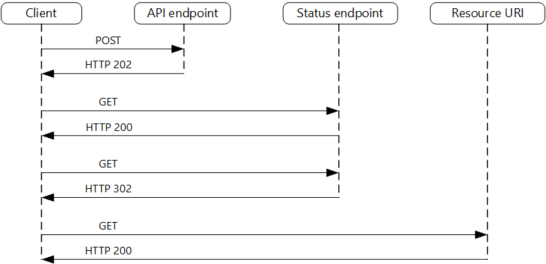

# Asynchronous Request-Reply

Decouple backend processing from a frontend host, where backend processing needs to be asynchronous, but the frontend still needs a clear response.

## Context and problem

In modern application development, it's normal for client applications — often code running in a web-client (browser) — to depend on remote APIs to provide business logic and compose functionality. These APIs may be directly related to the application or may be shared services provided by a third party. Commonly these API calls take place over the HTTP(S) protocol and follow REST semantics.

In most cases, APIs for a client application are designed to respond quickly, on the order of 100 ms or less. Many factors can affect the response latency, including:

- An application's hosting stack.
- Security components.
- The relative geographic location of the caller and the backend.
- Network infrastructure.
- Current load.
- The size of the request payload.
- Processing queue length.
- The time for the backend to process the request.

In some scenarios, the work done by backend may be long-running, on the order of seconds, or might be a background process that is executed in minutes or even hours. In that case, it isn't feasible to wait for the work to complete before responding to the request. This situation is a potential problem for any synchronous request-reply pattern.

Some architectures solve this problem by using a message broker to separate the request and response stages. This separation is often achieved by use of the Queue-Based Load Leveling pattern. This separation can allow the client process and the backend API to scale independently. But this separation also brings additional complexity when the client requires success notification, as this step needs to become asynchronous.

Many of the same considerations discussed for client applications also apply for server-to-server REST API calls in distributed systems — for example, in a microservices architecture.

## Solution

One solution to this problem is to use HTTP polling. Polling is useful to client-side code, as it can be hard to provide call-back endpoints or use long running connections. Even when callbacks are possible, the extra libraries and services that are required can sometimes add too much extra complexity

- The client application makes a synchronous call to the API, triggering a long-running operation on the backend.

- The API responds synchronously as quickly as possible. It returns an HTTP 202 (Accepted) status code, acknowledging that the request has been received for processing. The API should validate both the request and the action to be performed before starting the long running process. If the request is invalid, reply immediately with an error code such as HTTP 400 (Bad Request).

- The response holds a location reference pointing to an endpoint that the client can poll to check for the result of the long running operation.

- The API offloads processing to another component, such as a message queue.

- For every successful call to the status endpoint, it returns HTTP 200. While the work is still pending, the status endpoint returns a resource that indicates the work is still in progress. Once the work is complete, the status endpoint can either return a resource that indicates completion, or redirect to another resource URL. For example, if the asynchronous operation creates a new resource, the status endpoint would redirect to the URL for that resource.

1. The client sends a request and receives an HTTP 202 (Accepted) response.
2. The client sends an HTTP GET request to the status endpoint. The work is still pending, so this call returns HTTP 200.
3. At some point, the work is complete and the status endpoint returns 302 (Found) redirecting to the resource.
4. The client fetches the resource at the specified URL.

## When to use this pattern

### Use this pattern for

- Client-side code, such as browser applications, where it's difficult to provide call-back endpoints, or the use of long-running connections adds too much additional complexity.
- Service calls where only the HTTP protocol is available and the return service can't fire callbacks because of firewall restrictions on the client-side.
- Service calls that need to be integrated with legacy architectures that don't support modern callback technologies such as WebSockets or webhooks.

### This pattern might not be suitable when:

- You can use a service built for asynchronous notifications instead, such as Azure Event Grid.
- Responses must stream in real time to the client.
- The client needs to collect many results, and received latency of those results is important. Consider a service bus pattern instead.
- You can use server-side persistent network connections such as WebSockets or SignalR. These services can be used to notify the caller of the result.
- The network design allows you to open up ports to receive asynchronous callbacks or webhooks.
