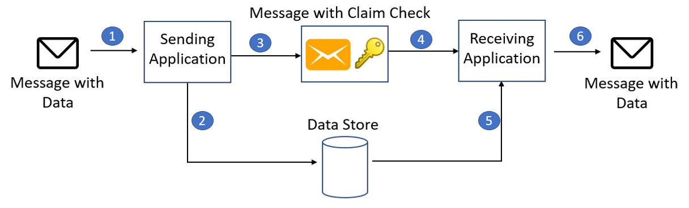

# Claim check

Split a large message into a claim check and a payload. Send the claim check to the messaging platform and store the payload to an external service. This pattern allows large messages to be processed, while protecting the message bus and the client from being overwhelmed or slowed down. This pattern also helps to reduce costs, as storage is usually cheaper than resource units used by the messaging platform.

## Context and Problem

A messaging-based architecture at some point must be able to send, receive, and manipulate large messages. Such messages may contain anything, including images (for example, MRI scans), sound files (for example, call-center calls), text documents, or any kind of binary data of arbitrary size.

Sending such large messages to the message bus directly is not recommended, because they require more resources and bandwidth to be consumed. Large messages can also slow down the entire solution, because messaging platforms are usually fine-tuned to handle huge quantities of small messages. Also, most messaging platforms have limits on message size, so you may need to work around these limits for large messages.

## Solution

Store the entire message payload into an external service, such as a database. Get the reference to the stored payload, and send just that reference to the message bus. The reference acts like a claim check used to retrieve a piece of luggage, hence the name of the pattern. Clients interested in processing that specific message can use the obtained reference to retrieve the payload, if needed.

1. Send message
2. Store message on the data store
3. Enqueue the message's reference
4. Read the message's reference
5. Retrieve the message
6. Process the message
