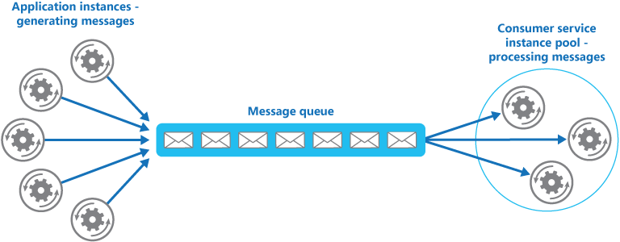

# Competing Consumers

Enable multiple concurrent consumers to process messages received on the same messaging channel. With multiple concurrent consumers, a system can process multiple messages concurrently to optimize throughput, to improve scalability and availability, and to balance the workload.

## Context and problem

An application running in the cloud is expected to handle a large number of requests. Rather than process each request synchronously, a common technique is for the application to pass them through a messaging system to another service (a consumer service) that handles them asynchronously. This strategy helps to ensure that the business logic in the application isn't blocked, while the requests are being processed.

The number of requests can vary significantly over time for many reasons. A sudden increase in user activity or aggregated requests coming from multiple tenants can cause an unpredictable workload. At peak hours, a system might need to process many hundreds of requests per second, while at other times the number could be very small. Additionally, the nature of the work performed to handle these requests might be highly variable. By using a single instance of the consumer service, you can cause that instance to become flooded with requests. Or, the messaging system might be overloaded by an influx of messages that come from the application. To handle this fluctuating workload, the system can run multiple instances of the consumer service. However, these consumers must be coordinated to ensure that each message is only delivered to a single consumer. The workload also needs to be load balanced across consumers to prevent an instance from becoming a bottleneck.

## Solution

Use a message queue to implement the communication channel between the application and the instances of the consumer service. The application posts requests in the form of messages to the queue, and the consumer service instances receive messages from the queue and process them. This approach enables the same pool of consumer service instances to handle messages from any instance of the application. The figure illustrates using a message queue to distribute work to instances of a service

This solution has the following benefits:

- It provides a load-leveled system that can handle wide variations in the volume of requests sent by application instances. The queue acts as a buffer between the application instances and the consumer service instances. This buffer can help minimize the impact on availability and responsiveness, for both the application and the service instances.
- It improves reliability. If a producer communicates directly with a consumer instead of using this pattern, but doesn't monitor the consumer, there's a high probability that messages could be lost or fail to be processed if the consumer fails. In this pattern, messages aren't sent to a specific service instance. A failed service instance won't block a producer, and messages can be processed by any working service instance.
- It doesn't require complex coordination between the consumers, or between the producer and the consumer instances. The message queue ensures that each message is delivered at least once.
- It's scalable. When you apply auto-scaling, the system can dynamically increase or decrease the number of instances of the consumer service as the volume of messages fluctuates.
- It can improve resiliency if the message queue provides transactional read operations. If a consumer service instance reads and processes the message as part of a transactional operation, and the consumer service instance fails, this pattern can ensure that the message will be returned to the queue to be picked up and handled by another instance of the consumer service. In order to mitigate the risk of a message continuously failing, we recommend you make use of dead-letter queues.

## Issues and considerations

- Message ordering. The order in which consumer service instances receive messages isn't guaranteed, and doesn't necessarily reflect the order in which the messages were created. Design the system to ensure that message processing is idempotent because this will help to eliminate any dependency on the order in which messages are handled.
- Designing services for resiliency. If the system is designed to detect and restart failed service instances, it might be necessary to implement the processing performed by the service instances as idempotent operations to minimize the effects of a single message being retrieved and processed more than once.
- Detecting poison messages. A malformed message, or a task that requires access to resources that aren't available, can cause a service instance to fail. The system should prevent such messages being returned to the queue, and instead capture and store the details of these messages elsewhere so that they can be analyzed if necessary.
- Handling results. The service instance handling a message is fully decoupled from the application logic that generates the message, and they might not be able to communicate directly. If the service instance generates results that must be passed back to the application logic, this information must be stored in a location that's accessible to both. In order to prevent the application logic from retrieving incomplete data the system must indicate when processing is complete.

## When to use this pattern

- The workload for an application is divided into tasks that can run asynchronously.
- Tasks are independent and can run in parallel.
- The volume of work is highly variable, requiring a scalable solution.
- The solution must provide high availability, and must be resilient if the processing for a task fails.

## When not to use this pattern

- It's not easy to separate the application workload into discrete tasks, or there's a high degree of dependence between tasks.
- Tasks must be performed synchronously, and the application logic must wait for a task to complete before continuing.
- Tasks must be performed in a specific sequence.
