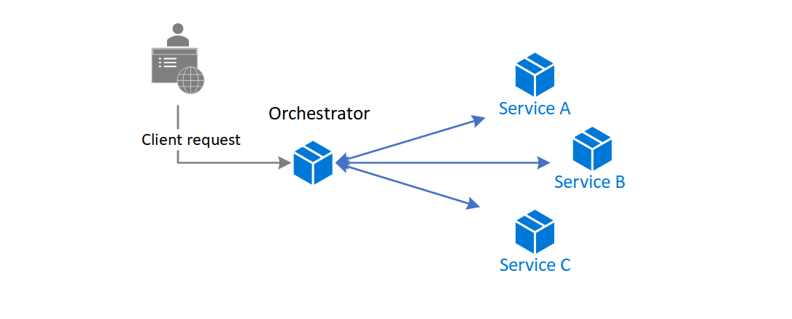
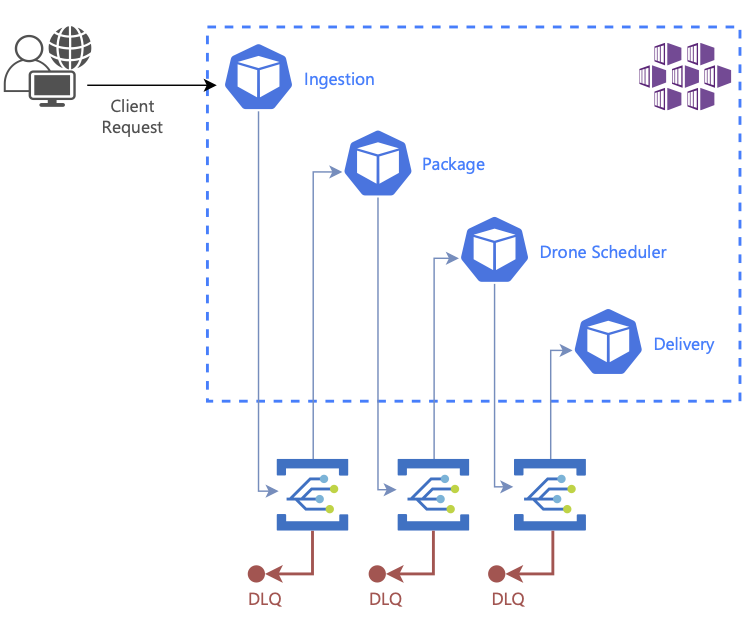

# Coreography Pattern

Have each component of the system participate in the decision-making process about the workflow of a business transaction, instead of relying on a central point of control

## Context and problem

In microservices architecture, it's often the case that a cloud-based application is divided into several small services that work together to process a business transaction end-to-end. To lower coupling between services, each service is responsible for a single business operation. Some benefits include faster development, smaller code base, and scalability.

The services communicate with each other by using well-defined APIs. Even a single business operation can result in multiple point-to-point calls among all services. A common pattern for communication is to use a centralized service that acts as the orchestrator. It acknowledges all incoming requests and delegates operations to the respective services. In doing so, it also manages the workflow of the entire business transaction. Each service just completes an operation and is not aware of the overall workflow.

The orchestrator pattern reduces point-to-point communication between services but has some drawbacks because of the tight coupling between the orchestrator and other services that participate in processing of the business transaction. To execute tasks in a sequence, the orchestrator needs to have some domain knowledge about the responsibilities of those services. If you want to add or remove services, existing logic will break, and you'll need to rewire portions of the communication path. While you can configure the workflow, add or remove services easily with a well-designed orchestrator, such an implementation is complex and hard to maintain.

## Solution

Let each service decide when and how a business operation is processed, instead of depending on a central orchestrator.

One way to implement choreography is to use the **asynchronous messaging** pattern to coordinate the business operations.

A client request publishes messages to a message queue. As messages arrive, they are pushed to subscribers, or services, interested in that message. Each subscribed service does their operation as indicated by the message and responds to the message queue with success or failure of the operation. In case of success, the service can push a message back to the same queue or a different message queue so that another service can continue the workflow if needed. If an operation fails, the message bus can retry that operation.

This way, the services choreograph the workflow among themselves without depending on an orchestrator or having direct communication between them.

## When to use this pattern

Use the choreography pattern if you expect to update or replace services frequently, and add or remove some services eventually. The entire app can be modified with less effort and minimal disruption to existing services.

Consider this pattern if you experience performance bottlenecks in the central orchestrator.

This pattern is a natural model for the serverless architecture where all services can be short lived, or event driven. Services can spin up because of an event, do their task, and are removed when the task is finished.

## Example

This example shows the choreography pattern with the Drone Delivery app. When a client requests a pickup, the app assigns a drone and notifies the client.

A single client business transaction requires three distinct business operations: creating or updating a package, assigning a drone to deliver the package, and checking the delivery status. Those operations are performed by three microservices: Package, Drone Scheduler, and Delivery services. Instead of a central orchestrator, the services use messaging to collaborate and coordinate the request among themselves.
