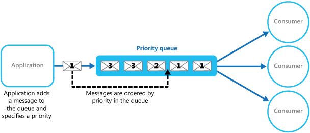
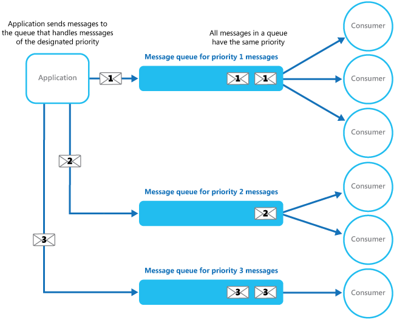

# Priority Queue

Prioritize requests sent to services so that requests with a higher priority are received and processed more quickly than those with a lower priority. This pattern is useful in applications that offer different service level guarantees to individual clients.

## Context and problem

Applications can delegate specific tasks to other services, for example, to perform background processing or to integrate with other applications or services. In the cloud, a message queue is typically used to delegate tasks to background processing. In many cases, the order in which requests are received by a service isn't important. In some cases, though, it's necessary to prioritize specific requests. These requests should be processed earlier than lower priority requests that were previously sent by the application.

## Solution

A queue usually is a first-in, first-out (FIFO) structure, and consumers typically receive messages in the same order that they're posted to the queue. However, some message queues support priority messaging. The application that's posting a message can assign a priority. The messages in the queue are automatically reordered so that those that have a higher priority are received before those that have a lower priority. This diagram illustrates the process:

In systems that don't support priority-based message queues, an alternative solution is to maintain a separate queue for each priority. The application is responsible for posting messages to the appropriate queue. Each queue can have a separate pool of consumers. Higher priority queues can have a larger pool of consumers that run on faster hardware than lower priority queues. This diagram illustrates the use of separate message queues for each priority:

A variation on this strategy is to implement a single pool of consumers that check for messages on high priority queues first, and only after that start to fetch messages from lower priority queues. There are some semantic differences between a solution that uses a single pool of consumer processes (either with a single queue that supports messages that have different priorities or with multiple queues that each handle messages of a single priority), and a solution that uses multiple queues with a separate pool for each queue.

In the single-pool approach, higher priority messages are always received and processed before lower priority messages. In theory, low priority messages could be continually superseded and might never be processed. In the multiple pool approach, lower priority messages are always processed, but not as quickly as higher priority messages (depending on the relative size of the pools and the resources that are available for them).

Using a priority-queuing mechanism can provide the following advantages:

- It allows applications to meet business requirements that require the prioritization of availability or performance, such as offering different levels of service to different groups of customers.

- It can help to minimize operational costs. If you use the single-queue approach, you can scale back the number of consumers if you need to. High priority messages are still processed first (although possibly more slowly), and lower priority messages might be delayed for longer. If you implement the multiple message queue approach with separate pools of consumers for each queue, you can reduce the pool of consumers for lower priority queues. You can even suspend processing for some very low priority queues by stopping all the consumers that listen for messages on those queues.

- The multiple message queue approach can help maximize application performance and scalability by partitioning messages based on processing requirements. For example, you can prioritize critical tasks so that they're handled by receivers that run immediately, and less important background tasks can be handled by receivers that are scheduled to run at times that are less busy.

## Considerations

Consider the following points when you decide how to implement this pattern:

- Define the priorities in the context of the solution. For example, a high priority message could be defined as a message that should be processed within 10 seconds. Identify the requirements for handling high priority items, and the resources that need to be allocated to meet your criteria.

- Decide whether all high priority items must be processed before any lower priority items. If the messages are processed by a single pool of consumers, you have to provide a mechanism that can preempt and suspend a task that's handling a low priority message if a higher priority message enters the queue.

I- n the multiple queue approach, when you use a single pool of consumer processes that listen on all queues rather than a dedicated consumer pool for each queue, the consumer must apply an algorithm that ensures it always services messages from higher priority queues before messages from lower priority queues.

Monitor the processing speed on high and low priority queues to ensure that messages in those queues are processed at the expected rates.

- If you need to guarantee that low priority messages will be processed, implement the multiple message queue approach with multiple pools of consumers. Alternatively, in a queue that supports message prioritization, you can dynamically increase the priority of a queued message as it ages. However, this approach depends on the message queue providing this feature.

- The strategy of using separate queues based on message priority is recommended for systems that have a few well-defined priorities.

- The system can logically determine message priorities. For example, rather than having explicit high and low priority messages, you could designate messages as "paying customer" or "non-paying customer." Your system could then allocate more resources to processing messages from paying customers.

- There might be a financial and processing cost associated with checking a queue for a message. For instance, some commercial messaging systems charge a small fee each time a message is posted or retrieved, and each time a queue is queried for messages. This cost increases when you check multiple queues.

When to use this pattern

This pattern is useful in scenarios where:

- The system must handle multiple tasks that have different priorities.

- Different users or tenants should be served with different priorities.
